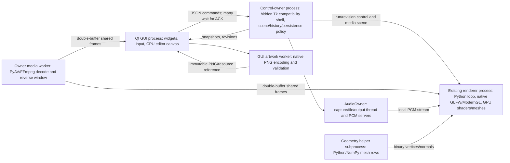

# ZeraWave / ZeraphinaX architecture assessment and incremental migration proposal

**Assessment date:** 2026-10-08
**Assessed source:** [realRMars/ZeraWave, main at 0fb4c3fa28632a6aaedb472be50b1837926b9caa](https://github.com/realRMars/ZeraWave/commit/0fb4c3fa28632a6aaedb472be50b1837926b9caa)
**Status:** assessment and proposed work only; Robert has not accepted a technology direction or a Builder assignment. This report does not change project guidance or authorize implementation, installation, migration, integration, release, commit, push, or worker dispatch.

## 1. Recommendation for Robert

**Choose selective native migration. Keep the existing Qt interface, Python authoring and musical-policy code, and working GPU renderer. Gradually give a small C++ core ownership of raster document resources, scheduled media work, and eventually the audio processing graph. Do not begin with a wholesale rewrite or an engine switch.**

The finished expanded product needs more than faster individual functions. It needs edits that remain responsive while files are saved, consistent selection and undo, composition that updates only what changed, media workers that cannot stall every layer, and an audio clock that can synchronize tracks and exported frames. Those responsibilities should have explicit ownership and bounded work. C++ is the strongest default here because Qt, FFmpeg, graphics APIs, painting libraries and mainstream plugin infrastructure already provide native interfaces. This is an ecosystem and integration judgement, not a claim that C++ automatically produces good performance or that Python caused every reported defect.

**Recommended next assignment:** a bounded raster transaction and recovery batch: make completed paint/selection operations, undo, renderer refresh and asynchronous persistence agree on one operation and revision. Remove whole-image PNG creation and synchronous GUI acknowledgement from the critical acceptance path. Preserve current appearance, controls, saved sessions and the existing renderer. Use existing native Qt image operations first. Introduce the C++ tiled raster core in the following batch, behind that stable interface. This sequence delivers a useful repair before paying the native build/toolchain cost; it does not make a prototype or benchmark a prerequisite for deciding the architecture.

My confidence is **high in the responsibility split**, **moderate in C++ as the primary new native implementation language**, and **moderate in raster transactions being the best first batch**. The latest review makes raster/layer reliability a strong priority, but Robert could reasonably put video playback first if it currently prevents his main workflow. Confidence in any promised speedup is low without current matched execution evidence. No new timing, GPU, motion, listening or usability tests were performed for this assessment.

The reason to avoid a large rewrite now is user experience and cumulative risk: the project already has valuable musical behaviour, scene identity, shader work, live colours, transport guards, session migration and Windows hosting. Rebuilding all of those consumes scarce agent credits before Robert receives a better editor. Keeping every high-rate responsibility in the current Python/Qt control topology indefinitely also has a growing cost. Selective migration preserves the working experience while creating reusable foundations for the expanded product.

## 2. Checkpoint, scope and access limitations

### Verified remotely now

The GitHub branch endpoint and commit endpoint returned:

| Item | Verification |
|---|---|
| Remote default branch | main |
| Remote main HEAD | 0fb4c3fa28632a6aaedb472be50b1837926b9caa |
| Commit | “Add Studio media composition and raster editing workflow” |
| Commit timestamp | 2026-10-08T20:02:44Z |
| Parent | fe1a7b74f791fbfcc1879798e5e944be50ae061f |
| Source tree | 9ac9aaece85554fadb1381f9132ae546d6046760 |
| Repository pushed timestamp | 2026-10-08T20:03:38Z |

This corroborates Robert's reported recovery push. All repository source links below bind to that exact commit; they do not follow future main changes.

### Recorded local receipt; not a fresh local verification

The Overseer's post-push receipt recorded C:\ZeraWave on main, local HEAD = origin/main = remote main at the SHA above, with origin https://github.com/realRMars/ZeraWave.git. Its working tree retained modified notes:

- docs/agent-notes/color-inspector-rollout.md
- docs/agent-notes/roots-live-colors.md
- docs/agent-notes/studio-palette-controls.md

It also recorded untracked DW Research/, Plan and brainstorms/, images n vids/, docs/agent-notes/startup-performance-01.md and docs/agent-notes/zeraphinax-plan-proposal.md. These are preserved, not classified as disposable. No private conversation export is a project deliverable.

**Fresh local branch, HEAD, status, remote-tracking state and process ownership could not be established.** The execution service failed before creating a PowerShell process with “setup refresh had errors.” No local git command, test, checkout file read or memory read actually ran. In particular, local memory_summary.md and untracked planning/research files remain uninspected. Do not infer their contents from the published tree.

The app task inventory did not show another Builder actively writing at its observed snapshot, but that is not a filesystem/process ownership guarantee. Accordingly this assessment uses the committed snapshot regardless of concurrent local work. The proposed migration must recheck ownership and dirty baselines before implementation.

### Evidence classes

- **Direct assessment evidence:** immutable GitHub source/docs, remote checkpoint APIs, primary public technical sources.
- **Historical project evidence:** Builder notes reporting tests/timings and failure limits, sometimes bound to dirty task baselines preceding this recovery commit.
- **User evidence:** Robert still reports substantial issues during review. These observations remain unresolved; previous passing checks do not overturn them.
- **Not inspected:** local evidence binaries, work/ harness outputs, native screenshots/sequences, live Studio, installed packages, actual GPU/device configuration or multi-hour runs.
- **No new execution evidence:** no syntax, unit, synthetic, GPU, decoded replay, controlled-live, natural listening, scanout, benchmark or prototype validation was performed.

The checkout-specific handoff, matched-performance and evidence-critique skills were read through their immutable repository versions because local access was unavailable: [handoff skill][skill-handoff], [matched-performance skill][skill-performance], [critique skill][skill-critique]. This is not a claim that the local checkout loaded them, and it does not constitute an authorized critic review.

## 3. What actually runs today

The app is **a mixed Python/native/GPU system**, not an application whose pixel, codec and FFT work is entirely interpreted Python.

### Process and scheduling map

This diagram omits ancillary validation, telemetry and file-overview workers for clarity. It does not imply that the diagrammed interfaces are zero-copy.

The [Qt shell][src-qt] creates native Qt widgets/docks and embeds the separately owned GLFW window through the Windows native handle. It has a lifecycle executor, a 200 ms general update timer and a 33 ms analyzer timer. Many ordinary edit callbacks still make synchronous control requests on the GUI thread. The [control client][src-client] writes JSON over subprocess pipes and waits on a condition for an acknowledgement, normally up to two seconds; stop/close have a longer limit. Lifecycle actions can run off the GUI thread, but that does not make all edits asynchronous.

The [control service][src-service] inherits the legacy Studio controller and starts a hidden Tk root. It owns composition history, registry/media sessions, audio ownership and state publication. Its tick handles up to eight commands, with snapshots published approximately every 200 ms. Domain state remains intertwined with legacy UI objects, including tuning/colour helpers. Process separation was a practical response to documented Tk/Qt and hosting failures, not evidence that Qt itself is unsuitable. The [Qt proof note][doc-qt-proof] records both failures and later working routes.

### Responsibility and ownership table

| Area | Python responsibility now | Native/GPU work now | Ownership/copy/scheduling implication |
|---|---|---|---|
| UI/input | Signal handlers, tools, mode/selection logic, snapshots, layout policy | PySide6/Qt widgets, event system, QPainter/QImage, docking extension, native HWND hosting | GUI must remain responsive; synchronous ACK and full-canvas work can block it even when the arithmetic is native. |
| Brush/erase/smudge | Dab spacing/interpolation and gesture orchestration | QPainter draws shapes/gradients; QImage copies; NumPy constraint arithmetic | Existing brush is not a Python per-pixel loop. Smudge copies and blends a local brush tile; it is not a natural-media simulation. |
| Selection/crop/mask/extract | Tool state, coordinate mapping, transformed target, commit rules | QPainterPath, Qt raster coverage; bounded NumPy gradient search for magnetic point | “Selection wrong” can be state/coordinates/scope, not insufficient native speed. Keep, Remove and raster-edit coverage have distinct meanings. |
| Layers/history | Validated dictionaries, hierarchy, scoped field patches, operation guards | Native pixel resources are retained externally as generated image files | Layer/Library/drawing scopes and GUI pending results must reconcile; stale completion is a correctness risk. |
| Editor composite | Recursive branch/group orchestration, image cache, dirty viewport | Native Qt blend modes plus NumPy Add/strength operations | CPU editor projections differ from GPU output; branch allocations and copies persist despite native arithmetic. |
| Output composite | Scene plan, lifetime/cache policy and GL call orchestration | GLSL full-screen blend passes, textures, RGBA16F framebuffer pairs | GPU resources belong to renderer thread; nested groups allocate full-output buffers under explicit caps. |
| Procedural worlds | Musical mapping, directors, clocks, parameter/cache/uniform updates | Native GL compilation/bindings; GPU fragment effects, prepasses, history, some resident meshes | Complex shader cost remains GPU work. C++ host code cannot cure excessive per-pixel work. |
| Mesh preparation | Bounded helper scheduling and some geometry construction | NumPy bulk math; GL upload/draw | Binary process transfer and synchronous row fallback/wait points still matter. |
| Audio | Source policy, engine/control/server threads, interpretation, envelopes/FFT orchestration | WASAPI through SoundCard/CFFI, SoundFile/libsndfile, NumPy FFT/math | One source owner today; native capture/FFT already exist. Current path is not a multitrack hard-real-time graph. |
| Video/GIF/sprite | Per-layer clocks, reverse window/cache, one serial worker scheduling sources | FFmpeg demux/decode/conversion through PyAV; native cached AVFrames | Codec work is native, but reverse seeks and the shared service queue can cause stalls. |
| Persistence | JSON migrations, dependency classification, hash paths and atomic replacements | Qt PNG encode/decode; OS file I/O | Per-stroke durable image creation is currently a publication boundary; save work is not merely a final export. |
| Packaging | Python runtime/application bundling scripts and launchers | CPython, Tcl, GL/audio libraries; Qt/media need their own packaging | Frozen player portable differs from an installable Studio product. No updater/licensing feature is delivered by this assessment. |

### Raster path: the acceptance boundary matters

[artwork.py][src-artwork] uses native Qt raster primitives for brush dabs and smudge tiles. Its constrained-edit code makes NumPy views of image storage and applies bounded strips to touched regions. In [studio_composition.py][src-editor], a gesture pins target/session/revision, holds private image buffers, previews locally and schedules encoding after release.

The generated resource path still performs **full-image PNG encoding, byte copying, hashing, store accounting, atomic file writing and registry inspection** before the new resource reference participates in composition commit/acknowledgement. A worker removes much of this from the immediate event handler, but it remains a semantic boundary for completed edits. Fast input and slow accepted-state propagation can coexist. [Source: artwork storage][src-artwork], [source: editor save/commit][src-editor-save].

Historical [editor correction evidence][doc-editor] reports a matched 1792×1008 source, 809×463 viewport, DPR 1, 120 points at 8 ms spacing and three repeats/tool. The scripted stroke sequence fell from roughly 22–23.6 seconds to roughly 0.963 seconds, with exact final PNG pixel parity for six cases. Yet release-to-encode/registry/ACK remained 1.57–1.63 seconds asynchronously. These are reported scripted Qt/event results, not new measurements, final physical-pointer acceptance or smudge performance evidence. They show why “Python made it slow” is an inadequate explanation and why Robert may still feel delayed completion.

### Compositing: two paths need one specification

The editor recursively projects CPU QImages. Add uses source-over alpha with special blend arithmetic; substituting QPainter Plus would change its semantics. [The current editor implementation][src-editor-add] processes integer NumPy strips, while partial blend strength still introduces copies and conversions. The renderer [image-layer compositor][src-images] performs corresponding blends on the GPU, with isolated groups and full-output targets.

Historical [media correction evidence][doc-media-corrections] reports editor Add paint median 261.72 → 71.22 ms at 1280×720/DPR 1, two native stills, 0.7 opacity and fixed moves including Qt grab. That is meaningful native-path improvement and still too costly for fluid dense dragging. Separate two-still GPU evidence reported a 0.272 ms component draw median; it is not an equivalent end-to-end editor or full-world workload. The target architecture should share blend/alpha/transform semantics while allowing CPU reference and GPU implementations.

The current contract is display-encoded RGB source-over, not a universally linear-light colour pipeline. A switch to linear compositing is an artistic/data compatibility decision, not a transparent speed fix. Retain authored shading and editable artistic roles unless a later approved direction explicitly changes them.

### Media: native codecs inside an avoidably coupled schedule

[media_frames.py][src-media] limits animated layers, native reverse-cache bytes and shared staging. FFmpeg/PyAV decode is already native, with two codec threads per decoder; one Python worker serially services animated sources. A long GOP reverse miss seeks to a prior keyframe and decodes forward. There is a work cap, but even bounded refill time can be too long for interactive presentation.

RGBA conversion, orientation, premultiplication and publication cross several buffers. The shared-frame reader copies bytes after checking a sequence/generation; each consumer has its own copy, and the renderer uploads changed RGBA frames to a texture. This is shared memory with consistency guards, not GPU zero-copy. The historical [correction report][doc-media-corrections] includes large-source intervals exceeding a second and continued high-rate limitations. Exact local binaries and clips were not re-opened here.

Improve service isolation, direction-aware prefetch and timestamp presentation before assuming a new language or hardware decoding will fix reverse playback. Hardware decode can introduce its own transfer/synchronization costs and does not remove inter-frame dependency. Optional user-visible proxies/intraframe working media may eventually help, but must never silently degrade original export quality.

### Worlds, forms, colours and simulation

[renderer.py][src-renderer] owns the window, GL context, resources, uniform updates, render loop, transitions and presentation. The large prepared shader route reduces some programme switching but also centralizes compilation. The [dated rendering inventory][doc-worlds] distinguishes analytic pixel surfaces, raymarch/volume effects, GPU preparation/history passes and actual resident Cavern/Citadel geometry. Main and Experimental variants are not interchangeable; experimental optimized passes are not proof of the same Main art.

[scene_surfaces.py][src-surfaces] sends geometry rows through a bounded subprocess; NumPy performs bulk math, while the renderer creates/uploads/draws GL buffers. Some required-row paths can still wait. [cymatics.py][src-cymatics] evaluates bounded modal data on the CPU and presents an analytic GPU field; this is not a general GPU fluid solver.

The model layer is a bounded static glTF/GLB subset: node transforms, triangle meshes, materials and textures, with simplified editor presentation; it is not a skeletal animation or general simulation engine. The optional Web layer has a descriptor/transport design but its browser backend is pending. Neither should be counted as a completed interactive-authoring foundation. [Sources: model layer][src-model] and [Web layer][src-web].

For future worlds, native host work is useful for expensive geometry/simulation and job scheduling. GPU compute/multipass simulation is appropriate where the workload fits, with state bounds, seek/reset rules and quality tiers. The current context contract requests OpenGL 3.3; do not assume it already provides a compute-shader capability contract. A context/capability upgrade or graphics API replacement should be a separate approved decision if the assigned simulation or measured workload requires it. Retain scene identity, musical response, manual pigment edits, palette behaviour and long-hold continuity.

### Audio and timing

[studio_transport.py][src-audio] uses one AudioOwner with capture/file/output and PCM-server threads. It can decode through native SoundFile/libsndfile, canonicalize to stereo 48 kHz chunks and scan with NumPy interpolation. Speed changes pitch; this is not independent time stretching. A bounded PCM stream feeds visual analysis, while output volume/mute is separate from raw analysis PCM. [analyzer.py][src-analyzer] uses native NumPy FFT/math with Python adaptive/beat/interpretation orchestration.

This is useful existing infrastructure, but not separate multichannel tracks, plugin routing, latency compensation or a device-sample-accurate master clock. The visible file position should not be assumed to equal the precise sample currently heard at the device. The future graph should publish sample position, discontinuity epoch and output latency; visuals and export should consume that clock instead of inventing another transport. Preserve the audio-analysis/visual-mapping boundary and current input behaviour.

### Persistence and distribution

Current [media guidance][doc-media] describes Library v2, artistic session v5, composition v4 and separately stored Qt layouts, with prior-schema migration. History is scoped and bounded; reopening clears it. Generated PNG dependencies are copied to a sibling assets directory, and external originals remain references. These are useful compatibility foundations, not a timeline/project database yet.

Component bounds include 32 layers, six nesting levels, 64 aggregate history commands, 256 MiB of estimated retained unique native history resources, a 512 MiB generated store, four animated sources, 96 MiB reverse cache and 128 MiB shared staging. These caps do not bound total RSS. GUI images, decoder planes, transfer bytes and GL residency coexist; account for transient peaks and duplicate consumers.

The [portable build][src-build] packages a player-oriented CPython/Tcl/native-library set. It does not establish product Studio packaging for Qt, PyAV, codecs or plugins. The [Qt requirements][src-req] and media guidance describe additional dependency pins and a pending WebEngine capability; the Web layer must not be described as a verified functioning browser. Preserve the frozen portable. Any new distribution is a separate release assignment with a new output path.

### CPU telemetry interpretation

[session_performance.py][src-perf] calculates process user+kernel CPU time divided by wall time, in units of **100% per fully occupied core**. [studio_resources.py][src-resources] sums distinct GUI/control-owner/renderer PIDs; GPU utilization is device-wide and memory totals are process working sets that can share pages.

Thus 112–123% is compatible with around 1.12–1.23 core equivalents, not automatically whole-machine overload. It could differ substantially from an all-core-normalized Task Manager view. However Robert's comparison lacked matching process set, timestamps, processor count and Task Manager column semantics in the evidence available here. **Normalization explains a plausible discrepancy; it is not a diagnosis of that observation.** Add a clearly labelled all-core-normalized companion value later, with known logical CPU count and matching samples. Never use a low average CPU value to dismiss event stalls or GPU/media deadlines.

## 4. Functional defects and performance architecture are different work

| Reported symptom | Functional/UX questions to resolve | Architectural risks supported by source | What is not established |
|---|---|---|---|
| Pencil/smudge lag | Target locked/hidden? Which tool? Active stroke vs accepted result? Focus/coordinates? | CPU projections, image copies, PNG/registry acceptance, GUI waits; smudge tile work | A current measured Python-only bottleneck; final smudge parity or responsiveness |
| Video rate/reverse stalls | Intent retained across direction/rate? Correct PTS and loop boundary? UI displays stale frame? | Serial source servicing, GOP refill, RGBA copies/upload, CPU editor draw | Universal native/hardware decoder speedup or zero-copy benefit |
| Add expensive | Correct alpha, blend strength, group isolation and transformed bounds? | Full projections, NumPy temporaries, per-branch allocations | C++ alone fixes bandwidth; GPU component timing equals editor timing |
| Selection/undo/refresh inconsistent | Selection meaning/scope, operation completion, target revision, undo scope and renderer publication | Multi-owner transaction choreography and delayed resource completion | These are all performance bugs, or all language bugs |
| Tool/layer controls confusing | Distinguish active tool, selected target, inherited locks/visibility and destructive result | Model/UI state intertwined; general snapshots/polling | A new framework improves labels or interaction automatically |
| Studio CPU high, Task Manager low | Same process set/period/normalization and stale/partial samples? | Different metric scales; separate processes | Machine-wide overload or a proved normalization-only explanation |

Fix correctness and clear affordances in the same user workflow that is being repaired. Do not hide wrong state behind faster redraw, silently change undo semantics, or broaden the first batch into a general Studio redesign.

## 5. Production evidence and what it supports

The following sources were accessed through free public documentation or official source repositories. **Documented mechanics** are distinguished from **my inference for ZeraWave**. None is a benchmark of this project.

### Blender: authoring API above a native evaluated scene

Blender's official source identifies [bpy_rna.cc](https://github.com/blender/blender/blob/main/source/blender/python/intern/bpy_rna.cc) as the Python interface to its native data API. Its [dependency graph query API](https://github.com/blender/blender/blob/main/source/blender/depsgraph/DEG_depsgraph_query.hh) distinguishes original and evaluated data. The [native evaluator](https://github.com/blender/blender/blob/main/source/blender/depsgraph/intern/eval/deg_eval.cc) schedules operations according to dependencies, uses task pools and retains single-thread paths for operations that require them.

**Inference:** retain flexible Python authoring while separating stable authored state from read-only evaluated render data and native heavy jobs. This supports a compiled display plan and bounded graph scheduling, not copying Blender's entire application architecture. Its [dependency-graph overview](https://developer.blender.org/docs/features/core/depsgraph/) was discoverable, but full-page fetch returned an access error in this runtime; source code supplied the implementation evidence. The inspected source is GPL-2.0-or-later: studying the technique and incorporating its code are separate choices.

### Godot: scene-facing code above servers and platform drivers

The [Godot 4.6 architecture overview](https://docs.godotengine.org/en/4.6/engine_details/architecture/godot_architecture_diagram.html) documents scene, server and driver/platform layers, with core and lifecycle services. Its [thread-safety guidance](https://docs.godotengine.org/en/stable/tutorials/performance/thread_safe_apis.html) warns that the active scene tree is not generally thread-safe and that direct GPU interactions from threads can stall. [GDExtension](https://docs.godotengine.org/en/stable/engine_details/engine_api/gdextension/index.html) exposes native shared-library extension points.

**Inference:** a resource handle/service boundary suits ZeraWave better than allowing every tool to mutate renderer objects. Godot is a credible larger-overhaul option if the product becomes primarily interactive 3D authoring. Its engine does not automatically supply this project's raster semantics, DAW routing, existing artwork or project migration. The engine's [MIT licence](https://godotengine.org/license/) is permissive with notice requirements; third-party dependencies still have their own terms.

### Unity: managed authoring does not imply interpreted heavy work

Unity's [Job System](https://docs.unity3d.com/6000.0/Documentation/Manual/job-system.html) describes scheduled parallel jobs. [Burst](https://docs.unity3d.com/Packages/com.unity.burst@1.8/manual/index.html) compiles a compatible subset of C# IL through LLVM to native code.

**Inference:** C# can be a serious authoring/runtime choice when data and execution are designed for it; language labels alone are poor performance arguments. Unity demonstrates managed/native/GPU separation, not that ordinary C# callbacks all receive Burst or that an engine adoption would preserve this editor. Unity's [current software terms](https://unity.com/legal/editor-terms-of-service/software) impose tier and use-right conditions; an end-user authoring platform deserves specific terms review rather than an assumption that a game runtime licence covers it. This is an adoption uncertainty, not a blanket technical dismissal.

### Krita and libmypaint: brush execution is only one part of a painting engine

Krita's [tile memento manager source](https://github.com/KDE/krita/blob/master/libs/image/tiles3/kis_memento_manager.h) documents tile changes, copy-on-write mementos, transaction commits and rollback/rollforward. Its [update scheduler interface](https://github.com/KDE/krita/blob/master/libs/image/kis_update_scheduler.h) coordinates strokes, projection updates, cancellation and threading. Its [Pixel Brush manual](https://docs.krita.org/en/reference_manual/brushes/brush_engines/pixel_brush_engine.html) describes spacing and tip behaviour, including multithreaded brush tips.

**Inference:** borrow tiled data ownership, ordered stroke transactions and region invalidation before building numerous brush variants. These source files carry GPL terms; the proposed design is independent implementation, not permission to copy them into an incompatible distribution.

The [libmypaint project](https://github.com/mypaint/libmypaint) provides a C brush engine, and its [surface API](https://github.com/mypaint/libmypaint/blob/master/mypaint-surface.h) separates dab generation from pixel storage via surface callbacks and atomic changed regions. Its [ISC licence](https://github.com/mypaint/libmypaint/blob/master/COPYING) is permissive with notices.

**Inference:** libmypaint is a plausible later natural-media brush dependency, behind ZeraWave's raster surface interface. It does not provide the complete layer/history/UI engine, and Windows builds, dependencies, tip/pressure mapping and maintenance must be accounted for. No dependency installation is assigned now.

### Audio/DAW infrastructure: deadlines govern the split

[PortAudio's callback guidance](https://portaudio.com/docs/v19-doxydocs/writing_a_callback.html) and [JACK's process callback rules](https://jackaudio.org/api/group__ClientCallbacks.html) exclude unbounded operations such as allocation, blocking I/O and unsuitable synchronization from real-time callbacks. JACK also exposes a separate freewheel/offline mode.

[JUCE AudioProcessorGraph](https://docs.juce.com/master/classjuce_1_1AudioProcessorGraph.html) models connected processing nodes/channels and exposes processing preparation and latency-related infrastructure. **Inference:** use a prepared native audio graph, a device sample clock and bounded control messages; keep Python authoring outside the callback. A graph library reduces infrastructure work but does not make a safe, compatible plugin host turnkey.

[JUCE's current licence](https://juce.com/legal/juce-8-licence/) must be evaluated for the intended distribution. The currently fetched [VST3 SDK licence](https://github.com/steinbergmedia/vst3sdk/blob/master/LICENSE.txt) is MIT; do not carry forward an obsolete assumption that every VST3 SDK use requires the former licence route. Plugin binaries, SDK dependencies, trademarks and individual compatibility remain separate. This is strategic source evidence, not legal clearance to redistribute a selected build.

### Existing native work must still obey ownership rules

[Qt threading documentation](https://doc.qt.io/qt-6/threads-modules.html) allows suitable QImage painting outside the GUI thread, while widgets remain GUI-thread work and concurrently painting one device is unsafe. [NumPy's thread-safety guidance](https://numpy.org/doc/stable/reference/thread_safety.html) explains that many operations release the GIL and warns about shared-array mutation.

**Inference:** existing native libraries can deliver early improvements without a new core, but data lifetime and scheduling must be designed. Moving the same full-image allocation chain into C++ is not enough. [FFmpeg licensing](https://ffmpeg.org/legal.html) depends on enabled components; the project's media note reports GPL codec components in the approved PyAV wheel. Verify the exact redistributed binaries later. [Qt module licensing](https://doc.qt.io/qt-6/licensing.html) likewise requires module-specific distribution review.

## 6. Alternatives and technology choice

| Direction | User-experience potential | Main cost/risk | Fit and recommendation |
|---|---|---|---|
| Continue current Python orchestration with better Qt/NumPy/GPU paths | Strong immediate gains from asynchronous commands, caching, region updates and fewer copies | Current hidden Tk/domain coupling and full-image history/publication can accumulate complexity; future audio deadlines need a different path | Use for early repairs and policy. Do not treat “keep Python everywhere” as the final expanded-product architecture. |
| Selective C++ core + Qt/Python + existing renderer | Direct native integration, deterministic resource ownership, SIMD/tiled work, native audio/media scheduling | Build/ABI/Windows packaging, memory-safety discipline, adapter maintenance | Recommended default. Move substantial responsibilities through a small stable boundary, not dozens of tiny per-dab calls. |
| Selective Rust core + Qt/Python | Explicit ownership and safe concurrency; strong fit for resource stores/job coordination | Unsafe FFI still needed around Qt/FFmpeg/graphics/plugin boundaries; binding/toolchain maintenance; ecosystem fit must be checked | Credible alternative if long-term maintainers prefer Rust. Compiler-checked ownership is documented in the [Rust book](https://doc.rust-lang.org/book/ch04-01-what-is-ownership.html). It does not guarantee latency or eliminate copies. |
| C#/.NET UI/control + native data/render/audio core | Strong Windows application tooling and productive UI authoring; native interoperability supported | Replacing current UI/tool integration; runtime allocation discipline; duplicate adapters/migrations | Technically viable, but insufficient present benefit to justify replacing Qt/Python. [.NET native interoperability](https://learn.microsoft.com/en-us/dotnet/standard/native-interop/) supports such a split; GC alone is not a diagnosis of future lag. |
| Full native Qt/C++ rewrite | One language and close library access; maximum low-level control | Rebuild authoring logic, regress established musical/art behaviour, longer time before useful delivery | Consider only after incremental boundaries demonstrate that Python control overhead/maintenance is still material. Native everywhere is not required for a high-quality result. |
| Godot-based product overhaul | Reusable 3D scene tooling, interaction, runtime/editor services and extensibility | Port scenes/shaders, reconstruct raster/DAW/project semantics; engine rendering model and custom-editor maintenance | Reconsider if interactive 3D authoring becomes the dominant product requirement. No current evidence makes it the best first move. |
| Unity-based overhaul | Mature managed/native job/render ecosystem and broad tooling | Porting cost, proprietary dependency, editor/product fit, custom raster/audio work still required | Viable strategic alternative, weaker present fit than selective migration. |
| Embed Blender/Krita as the product foundation | Mature specialist capabilities | Whole-application integration, UX/model mismatch, GPL compatibility and update burden | Study their techniques. Do not assume embedding or forking them is cheaper than a narrow native core. |

**Select one primary new native language.** Do not introduce C++, Rust and C# together merely to give each a subsystem. Existing third-party native libraries remain acceptable. A narrow C ABI with opaque handles gives Python and possible future UI shells a stable boundary; C++ internals need not become a public binary ABI.

No claim here proves a numerical language speed ranking. Relative credit cost is a judgement: current-path repairs are cheapest initially; selective migration costs more upfront but limits repeat work; a whole rewrite has the largest period of duplicated systems and revalidation. Minimize adapters and duplicated state owners rather than optimizing only the ease of writing the next patch.

## 7. Proposed target contracts

These are **planned**, not implemented or approved.

1. **One authoritative document model.** Stable document/session/target IDs, revisions and ordered operations own layers, masks, raster resources and undo. UI selection/tool focus is explicit presentation state; it must not accidentally become a conflicting scene owner. Readers receive immutable snapshots or leased resource handles. Toolkit widgets do not own persistent project policy.

2. **A resource service with clear pixel lifetime.** Record format, dimensions, stride, orientation, alpha convention and colour space on every buffer. CPU tiles are the raster authority for history/save/export; GPU textures/projections are caches keyed by document revision. Mutable stroke work cannot alias a published reader. Ownership transfer/lease release is explicit. First adapters can wrap native Qt images; the native tiled core later replaces storage behind the same contract.

3. **Ordered asynchronous edit outcomes.** Command IDs, expected revision and target; distinct accepted, applied/published, persisted and failed states. Never report a timeout as a definitely rejected operation. Coalesce replaceable previews, but preserve completed strokes, cut/crop and undo order. Saving flushes the chosen revision; failure retains recoverable accepted edits and clearly reports lack of durability.

4. **One composition specification.** Define alpha, blend strength, hierarchy isolation, mask order, source coordinates and transforms in shared fixtures. Keep existing encoded-RGB behaviour initially. CPU reference and GPU implementation consume the same compiled scene plan. Damage regions propagate through transforms and affected ancestors; stable sibling projections can be cached. Avoid CPU readback on every GPU editor frame.

5. **Explicit thread/process boundaries.** Qt widgets on GUI thread; one GL resource owner per context; bounded jobs and publication mailboxes; no decoder/file-save waits in input or render deadlines. Reuse current process isolation initially. Removing the hidden Tk shell and consolidating processes are separate proven-lifecycle migrations. Do not introduce cross-process GPU texture sharing just because it sounds faster.

6. **Media presentation by requested timestamp.** Per-source epochs invalidate seek/rate/direction work. A slow source cannot monopolize all sources. Publish the best ready frame for the clock; decode ahead within byte/time budgets. Dropping superseded video frames may be valid; dropping a completed paint operation is not. Keep presentation and decode progress distinct.

7. **Three timing domains for the expanded product.** Audio uses device sample time; video/visuals use rational timeline time derived from it or from live wall time; UI is asynchronous. Offline export advances explicit sample/frame times independent of GUI cadence. Stateful procedural clips require deterministic seeds and seek/checkpoint rules. Do not force all domains through a single “tick” callback.

8. **Native prepared audio graph later.** Channel layouts, routing, plugin delay/tails, immutable graph changes and preallocated processing buffers. Python may build/configure the graph and interpret musical features outside the real-time callback. Analyse taps retain raw/output distinctions. Plugin sandboxing and crash recovery are design choices to resolve before hosting third-party binaries.

9. **World/render compilation retains art.** Keep existing shader assets and colour-role declarations. Compile node/rack authoring into bounded jobs/render passes instead of per-pixel Python callbacks. GPU simulations need memory/quality limits, restart/resize cleanup, history-preserving colour edits and long-session behaviour. Nodes are an authoring representation, not an automatic renderer replacement.

10. **Versioned project storage and compatibility.** Preserve existing JSON migrations and portable assets. Add explicit project schemas only when timeline/graph work requires them; distinguish working edits, recoverable journal/checkpoints and durable Save. Never delete originals or historical evidence as “cleanup.” Packaging/updater/licensing/community-extension policy remain later product decisions.

## 8. Ordered migration batches

Effort is relative to this project: **S** focused existing-path repair; **M** several interacting modules; **L** new native subsystem/compatibility work; **XL** several separately authorized deliverables. These are not calendar estimates. Each accepted batch becomes one or more coherent Builder handoffs through Robert/Bob/Prompter; this report dispatches none.

### B0 — Approve direction and bind the implementation baseline (S, low engineering risk)

**Depends on:** Robert's review of this report.
**Work:** choose selective migration and the first outcome; establish fresh local branch/HEAD/status, ongoing ownership, dirty-file identities and preserved evidence. Record current source plus task-only baseline. No benchmark/prototype gate is required to approve the direction.
**Acceptance:** known source ownership, first batch scope/limits and user-visible success conditions agreed; no accidental assignment of future features.
**Checkpoint/rollback:** report remains a proposal. Commits/pushes require their own existing or new explicit authorization.

### B1 — Raster edit transactions, recovery and immediate publication (M–L, medium risk; recommended first)

**Depends on:** B0.
**Stays:** Qt shell/docks, current native Qt brush/smudge algorithms, artistic pixels, existing control owner/processes, renderer, colours/audio, saved schema where possible.
**Moves/changes:** completed raster edits become revisioned resource transactions, independent of durable PNG completion. Introduce a resource/snapshot adapter and asynchronous command outcome ledger. Cover existing paint/erase/smudge and selection-based edit completion, undo/redo and refresh through the same lifecycle; clarify active tool/target/scope within that workflow.

**Interface/ownership:** control owner remains logical document authority; resource handles refer to immutable native pixel snapshots with explicit lifetime. GUI owns private active gesture buffers only. Submit snapshot/damage once per completed operation through bounded binary/shared storage; metadata stays small JSON. Owner commits history and revision once, publishes to existing renderer, then schedules encoding. Save must wait for/fail the requested durable revision explicitly. A stale callback cannot rewrite a new document or layer.

**Acceptance:** rejected/locked/wrong-target edits do not enter history; completed edits are applied exactly once; immediate undo during encoding, redo, layer switch, session switch, Save/Save As, decoder activity and failed disk writes retain the correct result. Crop/cut/extraction retain documented semantics and placement; no silent undo-scope change. Test physical pointer/keyboard and visible output alongside synthetic coverage. Preserve existing brush pixel fixtures; report smudge limitations separately. Measure input/accept/publication/persistence delays, not just paint-call time. Any responsiveness budget in the Builder brief is a goal to verify on the actual device, not a guaranteed FPS.

**Rollback/checkpoint:** adapter/feature route can return to the current immutable-PNG path; keep original dependencies and saved-session compatibility. Never discard accepted unsaved edits when switching routes; flush or export a recovery checkpoint first. Deliver a usable Studio preview and limitations. This batch does **not** claim to solve dense Add performance, natural-media quality, video reverse or a general UI redesign.

### B2 — Native tiled raster/history and incremental composition (L, medium–high risk)

**Depends on:** stable B1 transactions; authorization for native build dependencies if absent. Split tiled storage/kernel work and GPU editor projection into separate handoffs if needed.
**Stays:** tools/authoring in Qt/Python, scene IDs, history semantics, saved asset compatibility, existing renderer.
**Moves:** C++ tile resource store, copy-on-write stroke history, dirty-region projection/composite kernels and bounded job scheduling. Use batched operations through a C ABI; no per-pixel Python callbacks. CPU reference remains for tests/export; evaluate a renderer-owned GPU projection path for dense editor composites without compulsory frame readback. Do not create a second playback engine.

**Interface/ownership:** document holds tile-version handles; stroke transaction owns changed tiles; undo swaps references/deltas; worker receives immutable source revisions. CPU/GPU caches have independent budgets and retirement rules. Masks and smudge neighbourhood reads have explicit halo/bounds. Preserve Add alpha/strength, rounding tolerance policy and group isolation.

**Acceptance:** current pixel/reference fixtures, transformed selections, alpha edges, nested groups, partial opacity/strength, undo after mixed structural/raster edits and store exhaustion. Matched native-sized pencil/smudge/Add interactions include p95/max latency, full-loop responsiveness, peak CPU/GPU allocations and resize/restart cleanup. No silently reduced canvas size/quality. Sustained repeated edits exercise tile eviction and history bounds.

**Rollback/checkpoint:** optional backend at project open; explicit resource materialization supports old PNG path. Preserve fixtures and current backend until acceptance; saved data must not depend on an unavailable experimental DLL.

### B3 — Media worker isolation, prefetch and presentation (M–L, medium risk)

**Depends on:** B0 and stable asynchronous control/publication; can be prioritized ahead of B2 if video is the main blocker.
**Stays:** asset registry, PyAV/FFmpeg codec capability, user rate/loop semantics, silent video/audio-source separation.
**Moves:** per-source decoder jobs and fair bounded scheduling, direction-aware cache/prefetch, explicit timestamp presentation and aggregate transfer accounting. C++ FFmpeg ownership is a reasonable native implementation; first scheduling repairs can use existing bindings. Keep one accountable media service, not an independent player per layer.

**Interface/ownership:** requested timeline time/epoch/direction; leased decoded planes or ready RGBA frames with format metadata; one render-thread upload owner. Stop/seek cancels generations without freeing buffers still read. Review hardware decode and working proxies as separate measured options, not default promises.

**Acceptance:** representative short/long-GOP files at 1×/6×/12×, both directions and boundaries, multiple sources with one deliberately slow, pause/stop/seek/hide/reopen, audio unaffected. Record decoded availability, published PTS, editor/output intervals and user-visible motion separately; p95/max and memory under warm/cold conditions. Last-frame/error policy is clear.

**Rollback/checkpoint:** retain original assets and current decoder route; direction cache can fall back visibly. Never silently change rate intent or source resolution.

### B4 — Toolkit-independent document/control service (M–L, medium risk)

**Depends on:** B1 ownership contracts and compatibility tests; preferably B2/B3 stable interfaces.
**Stays:** Qt widgets, transports and renderer.
**Moves:** session/model/history/validation/persistence policy out of hidden Tk widget inheritance into an explicit service façade. Python can retain policy; native core retains resource/work ownership. Remove legacy dependencies only after parity, caller inspection and separately authorized removal scope.

**Interface/ownership:** one versioned command/event protocol; snapshots contain changed sections/revisions rather than unnecessary full state; tuning/colour data are model objects with GUI adapters. Stop/load/save/window lifecycle must remain independently testable.

**Acceptance:** old sessions, missing assets, manual colour holds/reset, audio routes, launch/close/restart, HWND/DPI/focus and controlled native hosting. No duplicate FFT/capture or state owner. Preserve retained diagnostic/Tk route until an approved removal decision.

**Rollback/checkpoint:** old owner process behind same client contract. Avoid merging toolkit extraction with UI restyling or engine replacement.

### B5 — Native audio clock and processing graph (L–XL, high risk; later scope)

**Depends on:** explicit audio/timeline product brief, B4 control boundary, distribution/plugin decisions as needed.
**Stays:** musical feature semantics, visual mapping, current live-source functionality.
**Moves:** device callback, resampling/mixing, channel routing and graph execution to a prepared native engine. Select an established audio library rather than inventing device infrastructure. JUCE is a candidate for graph/plugin capability; licence/host requirements must be decided first. Keep decode/file I/O and graph compilation off callback.

**Interface/ownership:** preallocated audio blocks, sample-clock/latency/epoch events, safe graph publication, bounded control queues; analysis taps and meters outside deadline work. Separate multichannel audio/dialogue/FX belongs here only if assigned.

**Acceptance:** exact sample-order/seek/rate tests, channel mapping and clipping policy, output heard on actual devices, latency/drift, underruns under editing/render pressure, plugin failure/latency/tails if assigned. No allocations or blocking work on callback; retain input/mute/raw-analysis distinctions.

**Rollback/checkpoint:** selectable existing single-source AudioOwner, explicit project capability/versioning; no global audio-normalization retune to make one test song look better.

### B6 — Timeline, cues and deterministic offline export (XL, high risk; multiple briefs)

**Depends on:** clock contract, media service, persistence/versioning and stable render resource interface.
**Stays:** existing live worlds/shaders and visual parameters.
**Moves/adds:** rational-time visual clips/tracks, separate audio tracks, cue sequences, automation and offline evaluation/export. Renderer remains existing renderer with explicit evaluation time; export does not depend on GUI frame cadence.

**Interface/ownership:** project timeline owns clips and source references; audio sample time and frame time have an explicit conversion; procedural state has seeds/checkpoints and discontinuity rules. Offline mode allocates/encodes outside real-time, handles cancellation and partial outputs atomically.

**Acceptance:** repeatable frame/audio alignment, seek equivalence where supported, known exceptions for live input, encode/mux duration, loop/cue boundaries and long export. Preserve originals and live continuity. External VJ interoperability must be validated against named formats/protocols; none is established here.

**Rollback/checkpoint:** versioned opt-in project capability, playable old sessions, export cancellation recovery. Song/video export is not smuggled into B1.

### B7 — Modular authoring, richer worlds and optional simulation (XL, medium–high risk; priority chosen later)

**Depends on:** stable document/evaluation/resource/clock contracts; it need not wait for every B6 feature.
**Stays:** authored scene identities, catalog, colour declarations and existing shaders.
**Moves/adds:** typed node/rack graphs compiled into render/geometry/control jobs; native geometry/simulation kernels and GPU passes where justified. Natural-media brush adapters, custom tips/pressure, contextual workspaces and interactive/Flash-like authoring are separately scoped capabilities.

**Acceptance:** graph validation/cycles/type errors, bounded history/state, resize/restart, meaningful present-input musical response, quiet/release/event contrast and extended interest. Long holds/soaks and matched resource costs accompany artistic review; numerical colour changes are not a creative acceptance certificate.

**Rollback/checkpoint:** preserve existing forms and accepted presets, version graph/palette IDs; simulation state can be reset/recovered explicitly. A full graphics API/engine replacement needs its own proposal.

### B8 — Distribution, updates, licensing and community customization (XL, release/product decisions)

**Depends on:** stable chosen native/runtime dependencies and assigned release scope.
**Strategic work:** executable packaging, notices/codec/plugin licensing, signed updates/rollback, versioned extension compatibility and customization policy. Trusted internal authoring and untrusted community code have different security boundaries; avoid executing arbitrary extensions in the audio callback or render-resource owner.

**Acceptance:** clean Windows install/upgrade/uninstall, missing-dependency handling, actual redistributed licence inventory and recoverable update; new build path.
**Rollback:** preserve frozen portable and previous product release. These are strategic considerations only and **are not features of the next Builder batch**.

### If Robert chooses a larger overhaul instead

Do not start by rewriting the UI and renderer together. First approve a product responsibility/schema/compatibility contract; then port one bounded end-to-end vertical slice using the current fixtures/assets. Preserve old playback and load/save while moving document resources and media/clock ownership. Port authored worlds and colour IDs next; only then replace the interface or engine host. A side-by-side experimental runtime would require explicit authorization because the current agreement prohibits unrequested duplicate renderers. Evidence and data migration remain required; engine adoption is not a shortcut around them.

## 9. Recommended first Builder brief boundary

**Visible result:** when Robert paints, edits a selection or presses Undo, the canvas, layer target, history and output converge on the same accepted operation promptly. Background image storage must not make the operation appear uncommitted or allow a late callback to undo newer work.

**Included:** B1 transaction states, immutable runtime pixel-resource adapter, ordered async acknowledgements, immediate publication/recovery, scoped tool/target feedback, and save/failure behaviour. Preserve brush shape/palette and existing selection/crop/mask/extraction semantics.

**Excluded:** C++ tile engine, new brush physics, new blend modes, whole Studio redesign, decoder overhaul, multitrack audio, timeline/export, plugin host, updater, paid services and engine replacement. Existing Add/smudge cost is measured/reported but not automatically all repaired by B1.

Before sending the brief, Prompter and Bob should translate Robert's failing review cases into reproducible actions, retaining his words and distinguishing “input delayed,” “stroke completed but output delayed,” and “wrong result.” This is brief preparation, not a request to Robert to prove the defect. If exact examples are unavailable, the Builder can inspect the current workflow and include bounded manual recovery cases.

Relevant existing standalone scripts include raster_workflow_test.py, raster_workflow_pixels_test.py, composition_test.py, composition_canvas_test.py, media_recovery_test.py, studio_editing_test.py and studio_media_test.py. Use the project .venv and existing standalone conventions; select affected checks after inspecting callers. Tests are suggestions here, **not checks executed**. Broader renderer/audio/colour preservation checks are justified at the integrated batch boundary. Preserve failures and source hashes.

Robert's user acceptance remains separate from passing checks and from any later authorized critique. Prompter prepares the agreed handoff; this assessment does not send it.

## 10. Guidance reconciliation inventory — after direction approval

No listed guidance was edited by this assessment. Owners must distinguish **current code**, **approved plan**, **unaccepted candidate**, **historical evidence**, and **future idea**. Do not rewrite historical measurements as newly validated results.

| Existing Markdown | What would need reconciliation | Timing/owner |
|---|---|---|
| AGENTS.md | Any approved native-core/build/interface exception to current renderer/audio boundaries; preservation, dependency and ownership rules continue | Overseer, after approval; not a blanket rewrite licence |
| ROADMAP.md | Chosen technology direction, ordered batches and next authorized outcome; later features remain planned | Overseer sole plan |
| ZERAWAVE_HANDOFF.md | Recovery commit, actual dirty baseline, latest review issues and evidence limits; later update with implemented batch results | Overseer checkpoint; current assessment adds no acceptance |
| README.md | Entry map for current Qt/media workflow and eventually native prerequisites; current “development tool” wording versus an approved product direction | Overseer, stages tied to real implementation |
| ZERAWAVE_VISUAL_IDENTITY.md | Approved expanded authoring/product intent only where useful; preserve music/identity standards and avoid asserting future features exist | Overseer shared direction |
| DEVELOPMENT_STUDIO.md | Actual tool/target/undo/publication behaviour, controls and launch/review steps after B1; native backend setup only after B2 exists | Coordinated feature documentation; shared entry map ownership respected |
| docs/STUDIO_MEDIA_COMPOSITION.md | Runtime resource/persistence boundary, history lifetime, alpha/composition contracts and current limits; pending browser capability remains pending | Assigned feature documentation, updated with actual results |
| TECHNIQUE_LIBRARY.md | Reusable native/resource/composition interfaces and compatibility when implemented; no speculative components registered as shipped | Assigned technique ownership coordinated with Overseer |
| docs/MAINTENANCE_CONTRACTS.md | Preservation checks for hosting, audio analysis and renderer; extend with approved raster/media ownership tests | Assigned maintenance scope; no deletion of old safeguards |
| docs/AUDIO_DESCRIPTORS.md | Analysis taps/clock/transport changes only when B5 is assigned and implemented; preserve analysis-versus-mapping responsibility | Later audio documentation scope |
| PLAYER.md | Studio product runtime versus frozen portable; new native/library distribution steps only in a release assignment | Later packaging scope |
| ZERAWAVE_WORLDFORM_RENDERING_INVENTORY_2026-10-05.md | Retain dated baseline; add a separate dated inventory for actual future graph/pass/simulation changes | Dated evidence, not silently rewritten |
| .agents/skills/zerawave-task-handoff/SKILL.md | New source/resource/schema binding expectations if needed; existing review route remains | Owner-approved skill change only |
| .agents/skills/zerawave-matched-performance/SKILL.md | Add native/tile/media clock boundaries if implemented; matched conditions and evidence classes continue | Owner-approved skill change only |
| .agents/skills/zerawave-evidence-critique/SKILL.md | Architecture does not convert technical tests into art acceptance; revise only for an actual approved review workflow need | No critic dispatch implied |
| docs/agent-notes/qt-studio-proof-20261005.md; studio-audio-hub-20261006.md; audio-timeline-20261007.md; audio-volume-drive-20261007.md; media-library-increment1-20261007.md; media-composition-20261007.md; media-corrections.md; media-corrections2.md; raster-workflow-repair.md; editor-correction-20261008.md | Retain task-time identity, failures and limits. Link new result notes/checkpoint to superseded status; do not replace “uncommitted at task time” with invented contemporary measurements | Historical notes; new task note per actual batch |
| COSMIC_DEVELOPMENT.md; ELEMENTAL_DEVELOPMENT.md; MILKDROP_COMPARISON.md; docs/history/ | No wholesale reconciliation required: keep dated archives/pointers. Amend only demonstrated broken references | Archive contents were not comprehensively reread |
| Locally dirty/untracked planning/research notes recorded above | Compare current purpose and content before any reconciliation; do not discard or infer that they agree with this report | Local access/owner needed; not inspected |

The committed root checkpoint documents predate some of the latest media/editor results. That is a documentation freshness issue, not authority to overwrite them during this assessment. This report is the new isolated proposal file; it is not a second roadmap.

## 11. Decisions actually needed

1. **Approve the split and first priority.** Recommended: selective native direction, B1 raster transactions first, B2 native tiles/composition next. If reverse video is currently the main blocker, authorize B3 ahead of B2.
2. **Confirm native language/toolchain at the native batch boundary.** Recommended C++; choose Rust instead if Robert's intended long-term maintainers have a stronger Rust commitment. No compiler/package installation is needed to review this report.
3. **Provide a few concrete review failures if readily available.** They improve B1 acceptance cases. The absence of a detailed reproduction is not a reason to deny the observed defects.
4. **Resolve product/licensing/plugin decisions later, when their batch is proposed.** Distribution openness/commercial intent, VST host scope, audio channel targets and external VJ formats affect later library choices. They do not have to delay B1.

No decision is needed now about every future feature, a replacement graphics API, updater implementation, browser installation or a full engine adoption.

## 12. Deliverable and handoff status

This report proposes a finished-product architecture and a bounded next step. It includes no implementation, benchmark prototype, dependency changes, commits, pushes, guidance edits or dispatch. Remote recovery checkpoint verification succeeded. Local environment verification remains blocked by execution-service startup failure; exact dirty-source and local-evidence coverage must be restored before a Builder changes anything.

File creation/update was accepted by the patch tool. Independent read-back, local Git diff/status and filesystem verification remain unavailable because shell startup still fails; opening the file in Codex returned queued, which is not a read-back verification. Markdown references were checked in the prepared report text, with no undefined reference links. Direct progress messaging to the parent task returned “thread not found”; the final delegation result carries this handoff.

The next action is Robert/Bob review of this recommendation, then Prompter preparation of **one agreed Builder brief**. Preserve the published checkpoint and unrelated working files. Do not read the existence of this report as implementation approval.

## Source index: immutable project evidence

[skill-handoff]: https://github.com/realRMars/ZeraWave/blob/0fb4c3fa28632a6aaedb472be50b1837926b9caa/.agents/skills/zerawave-task-handoff/SKILL.md
[skill-performance]: https://github.com/realRMars/ZeraWave/blob/0fb4c3fa28632a6aaedb472be50b1837926b9caa/.agents/skills/zerawave-matched-performance/SKILL.md
[skill-critique]: https://github.com/realRMars/ZeraWave/blob/0fb4c3fa28632a6aaedb472be50b1837926b9caa/.agents/skills/zerawave-evidence-critique/SKILL.md
[src-qt]: https://github.com/realRMars/ZeraWave/blob/0fb4c3fa28632a6aaedb472be50b1837926b9caa/app/visuals/studio_qt.py#L137
[src-client]: https://github.com/realRMars/ZeraWave/blob/0fb4c3fa28632a6aaedb472be50b1837926b9caa/app/visuals/studio_control_client.py#L39
[src-service]: https://github.com/realRMars/ZeraWave/blob/0fb4c3fa28632a6aaedb472be50b1837926b9caa/app/visuals/studio_control_service.py#L24
[src-artwork]: https://github.com/realRMars/ZeraWave/blob/0fb4c3fa28632a6aaedb472be50b1837926b9caa/app/visuals/artwork.py#L37
[src-editor]: https://github.com/realRMars/ZeraWave/blob/0fb4c3fa28632a6aaedb472be50b1837926b9caa/app/visuals/studio_composition.py#L508
[src-editor-save]: https://github.com/realRMars/ZeraWave/blob/0fb4c3fa28632a6aaedb472be50b1837926b9caa/app/visuals/studio_composition.py#L1467
[src-editor-add]: https://github.com/realRMars/ZeraWave/blob/0fb4c3fa28632a6aaedb472be50b1837926b9caa/app/visuals/studio_composition.py#L32
[src-images]: https://github.com/realRMars/ZeraWave/blob/0fb4c3fa28632a6aaedb472be50b1837926b9caa/app/visuals/image_layers.py#L211
[src-media]: https://github.com/realRMars/ZeraWave/blob/0fb4c3fa28632a6aaedb472be50b1837926b9caa/app/visuals/media_frames.py#L53
[src-renderer]: https://github.com/realRMars/ZeraWave/blob/0fb4c3fa28632a6aaedb472be50b1837926b9caa/app/visuals/renderer.py#L652
[src-surfaces]: https://github.com/realRMars/ZeraWave/blob/0fb4c3fa28632a6aaedb472be50b1837926b9caa/app/visuals/scene_surfaces.py#L217
[src-cymatics]: https://github.com/realRMars/ZeraWave/blob/0fb4c3fa28632a6aaedb472be50b1837926b9caa/app/visuals/cymatics.py
[src-audio]: https://github.com/realRMars/ZeraWave/blob/0fb4c3fa28632a6aaedb472be50b1837926b9caa/app/audio/studio_transport.py#L27
[src-analyzer]: https://github.com/realRMars/ZeraWave/blob/0fb4c3fa28632a6aaedb472be50b1837926b9caa/app/audio/analyzer.py
[src-model]: https://github.com/realRMars/ZeraWave/blob/0fb4c3fa28632a6aaedb472be50b1837926b9caa/app/visuals/model_layer.py
[src-web]: https://github.com/realRMars/ZeraWave/blob/0fb4c3fa28632a6aaedb472be50b1837926b9caa/app/visuals/studio_web_layer.py
[src-build]: https://github.com/realRMars/ZeraWave/blob/0fb4c3fa28632a6aaedb472be50b1837926b9caa/build_portable.py
[src-req]: https://github.com/realRMars/ZeraWave/blob/0fb4c3fa28632a6aaedb472be50b1837926b9caa/requirements-qt-studio.txt
[src-perf]: https://github.com/realRMars/ZeraWave/blob/0fb4c3fa28632a6aaedb472be50b1837926b9caa/app/visuals/session_performance.py#L48
[src-resources]: https://github.com/realRMars/ZeraWave/blob/0fb4c3fa28632a6aaedb472be50b1837926b9caa/app/visuals/studio_resources.py#L4
[doc-qt-proof]: https://github.com/realRMars/ZeraWave/blob/0fb4c3fa28632a6aaedb472be50b1837926b9caa/docs/agent-notes/qt-studio-proof-20261005.md
[doc-editor]: https://github.com/realRMars/ZeraWave/blob/0fb4c3fa28632a6aaedb472be50b1837926b9caa/docs/agent-notes/editor-correction-20261008.md
[doc-media-corrections]: https://github.com/realRMars/ZeraWave/blob/0fb4c3fa28632a6aaedb472be50b1837926b9caa/docs/agent-notes/media-corrections.md
[doc-media]: https://github.com/realRMars/ZeraWave/blob/0fb4c3fa28632a6aaedb472be50b1837926b9caa/docs/STUDIO_MEDIA_COMPOSITION.md
[doc-worlds]: https://github.com/realRMars/ZeraWave/blob/0fb4c3fa28632a6aaedb472be50b1837926b9caa/ZERAWAVE_WORLDFORM_RENDERING_INVENTORY_2026-10-05.md
